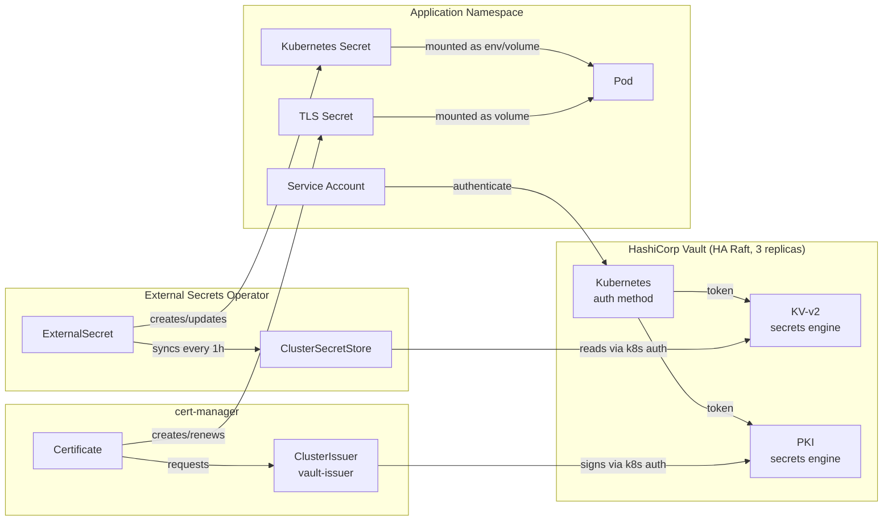

# secrets-management

Secrets and certificate management for a self-hosted Kubernetes cluster using HashiCorp Vault, External Secrets Operator, and cert-manager.

## Architecture



## Components

| Component | Version | Purpose |
|-----------|---------|---------|
| HashiCorp Vault | 1.18.0 | Secrets storage, PKI CA |
| External Secrets Operator | 0.14.0 | Sync Vault secrets → K8s Secrets |
| cert-manager | v1.17.1 | Issue and renew TLS certificates |

## Structure

```
.
├── argocd/
│   ├── vault.yaml                    # ArgoCD app for Vault
│   ├── external-secrets.yaml         # ArgoCD app for ESO
│   └── cert-manager.yaml             # ArgoCD app for cert-manager
├── vault/
│   ├── values.yaml                   # Vault Helm values (HA Raft, 3 replicas)
│   ├── init.sh                       # One-time init: unseal, enable engines, configure k8s auth
│   └── add-app-role.sh               # Register a new app in Vault
├── external-secrets/
│   ├── values.yaml                   # ESO Helm values
│   └── cluster-secret-store.yaml     # ClusterSecretStore pointing to Vault
├── cert-manager/
│   └── vault-issuer.yaml             # ClusterIssuer using Vault PKI
└── examples/
    ├── app-secret/
    │   └── external-secret.yaml      # ExternalSecret pulling from Vault KV
    └── tls-cert/
        └── certificate.yaml          # Certificate issued by Vault PKI
```

## How It Works

### Application Secrets (KV-v2 → K8s Secret)

1. Store secret in Vault: `vault kv put secret/<namespace>/<app>/config key=value`
2. Create an `ExternalSecret` in the app namespace pointing to the key
3. ESO authenticates to Vault using the `external-secrets` service account
4. ESO syncs the secret into a Kubernetes `Secret` on a 1-hour interval

### TLS Certificates (Vault PKI → cert-manager)

1. cert-manager requests a certificate from the `vault-issuer` ClusterIssuer
2. Vault PKI signs it using the intermediate CA
3. cert-manager stores the certificate in a Kubernetes `Secret`
4. cert-manager auto-renews 15 days before expiry

## Deploy

```bash
# Deploy via ArgoCD
kubectl apply -f argocd/cert-manager.yaml
kubectl apply -f argocd/vault.yaml
kubectl apply -f argocd/external-secrets.yaml

# Initialize Vault (once, after first deploy)
chmod +x vault/init.sh
./vault/init.sh

# Apply ClusterSecretStore and ClusterIssuer
kubectl apply -f external-secrets/cluster-secret-store.yaml
kubectl apply -f cert-manager/vault-issuer.yaml
```

## Add a New Application

```bash
# 1. Register the app in Vault (creates policy + k8s auth role)
./vault/add-app-role.sh <app-name> <namespace>

# 2. Store the app's secrets in Vault
vault kv put secret/<namespace>/<app-name>/config \
  db_password="..." \
  api_key="..."

# 3. Create an ExternalSecret in the app namespace (see examples/app-secret/)
# 4. Create a Certificate if TLS is needed (see examples/tls-cert/)
```

## Vault Auth Flow

```
Pod → ServiceAccount token → Vault /auth/kubernetes/login
    → Vault validates token against K8s API
    → Returns Vault token with app-scoped policy
    → ESO uses token to read secrets
```

Each application gets a policy scoped strictly to its own path:
```hcl
path "secret/data/<namespace>/<app>/*" {
  capabilities = ["read", "list"]
}
```
