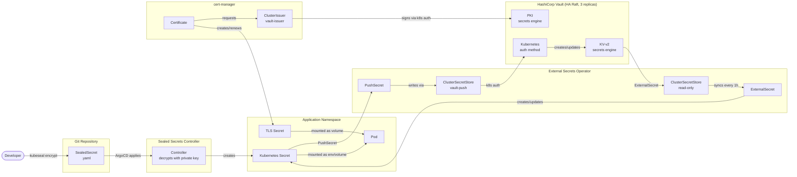

# secrets-management

Secrets and certificate management for a self-hosted Kubernetes cluster using HashiCorp Vault, External Secrets Operator, Sealed Secrets, and cert-manager.

## Architecture



## Components

| Component | Version | Purpose |
|-----------|---------|---------|
| HashiCorp Vault | 1.18.0 | Secrets storage, PKI CA |
| External Secrets Operator | 0.14.0 | Sync Vault secrets ↔ K8s Secrets |
| Sealed Secrets | 2.17.1 | Encrypt K8s Secrets for safe Git storage |
| cert-manager | v1.17.1 | Issue and renew TLS certificates |

## Structure

```
.
├── argocd/
│   ├── vault.yaml                         # ArgoCD app for Vault
│   ├── external-secrets.yaml              # ArgoCD app for ESO
│   ├── sealed-secrets.yaml                # ArgoCD app for Sealed Secrets controller
│   └── cert-manager.yaml                  # ArgoCD app for cert-manager
├── vault/
│   ├── values.yaml                        # Vault Helm values (HA Raft, 3 replicas)
│   ├── init.sh                            # One-time init: unseal, enable engines, configure k8s auth
│   └── add-app-role.sh                    # Register a new app in Vault
├── sealed-secrets/
│   ├── fetch-cert.sh                      # Fetch controller public cert (run once, commit the cert)
│   └── pub-cert.pem                       # Public cert for offline encryption (safe to commit)
├── external-secrets/
│   ├── values.yaml                        # ESO Helm values
│   ├── cluster-secret-store.yaml          # ClusterSecretStore (read-only) for pulling secrets
│   └── cluster-secret-store-push.yaml     # ClusterSecretStore (write) for pushing secrets
├── cert-manager/
│   └── vault-issuer.yaml                  # ClusterIssuer using Vault PKI
└── examples/
    ├── gitops-secret/                      # Full GitOps flow: Git → K8s Secret → Vault
    │   ├── secret.yaml                    # Plain secret template (DO NOT commit — encrypt first)
    │   ├── sealed-secret.yaml             # Encrypted SealedSecret (safe to commit)
    │   └── push-secret.yaml               # PushSecret: K8s Secret → Vault KV
    ├── app-secret/
    │   └── external-secret.yaml           # ExternalSecret: Vault KV → K8s Secret
    ├── push-secret/
    │   └── push-secret.yaml               # PushSecret: K8s Secret → Vault KV (manual flow)
    └── tls-cert/
        └── certificate.yaml               # Certificate issued by Vault PKI
```

## How It Works

### GitOps Flow — Full Cycle (recommended)

This is the complete GitOps-safe flow. Secrets never appear in plaintext in Git.

```
Developer → kubeseal encrypt → SealedSecret.yaml committed to Git
    → ArgoCD applies SealedSecret → controller decrypts → K8s Secret
    → PushSecret → ESO → Vault KV
    → ExternalSecret → ESO → K8s Secret (other apps can pull)
```

1. Fetch the controller's public certificate (once): `./sealed-secrets/fetch-cert.sh`
2. Create a plain `Secret` locally (see `examples/gitops-secret/secret.yaml`)
3. Encrypt it: `kubeseal --cert sealed-secrets/pub-cert.pem -f secret.yaml -w sealed-secret.yaml`
4. Commit `sealed-secret.yaml` — the encrypted values are safe to store in Git
5. ArgoCD applies it → Sealed Secrets controller creates the K8s Secret in the cluster
6. The `PushSecret` pushes the values to Vault KV automatically

### Application Secrets — Pull from Vault (Vault → K8s Secret)

1. Store secret in Vault: `vault kv put secret/<namespace>/<app>/config key=value`
2. Create an `ExternalSecret` in the app namespace pointing to the key
3. ESO authenticates to Vault using the `external-secrets` service account
4. ESO syncs the secret into a Kubernetes `Secret` on a 1-hour interval

### Push Secrets — Push to Vault (K8s Secret → Vault KV)

1. Create a Kubernetes Secret (manually or via SealedSecret)
2. Create a `PushSecret` referencing it — ESO uses the `vault-push` ClusterSecretStore
3. ESO authenticates to Vault using the `external-secrets-push` service account (eso-push policy)
4. ESO writes the secret keys to the Vault KV path on a 1-hour interval

### TLS Certificates (Vault PKI → cert-manager)

1. cert-manager requests a certificate from the `vault-issuer` ClusterIssuer
2. Vault PKI signs it using the intermediate CA
3. cert-manager stores the certificate in a Kubernetes `Secret`
4. cert-manager auto-renews 15 days before expiry

## Deploy

```bash
# 1. Deploy all components via ArgoCD
kubectl apply -f argocd/sealed-secrets.yaml
kubectl apply -f argocd/cert-manager.yaml
kubectl apply -f argocd/vault.yaml
kubectl apply -f argocd/external-secrets.yaml

# 2. Initialize Vault (once, after first deploy)
chmod +x vault/init.sh
./vault/init.sh

# 3. Apply ClusterSecretStores and ClusterIssuer
kubectl apply -f external-secrets/cluster-secret-store.yaml
kubectl apply -f external-secrets/cluster-secret-store-push.yaml
kubectl apply -f cert-manager/vault-issuer.yaml

# 4. Fetch the Sealed Secrets public cert and commit it
chmod +x sealed-secrets/fetch-cert.sh
./sealed-secrets/fetch-cert.sh
git add sealed-secrets/pub-cert.pem && git commit -m "chore: add sealed-secrets public cert"
```

## Add a New Application

### GitOps flow (recommended)

```bash
# 1. Register the app in Vault
./vault/add-app-role.sh <app-name> <namespace>

# 2. Create and encrypt the secret
cp examples/gitops-secret/secret.yaml my-secret.yaml
# edit my-secret.yaml with real values
kubeseal --cert sealed-secrets/pub-cert.pem \
         --scope namespace-wide \
         -f my-secret.yaml \
         -w <namespace>/<app-name>-sealed-secret.yaml
rm my-secret.yaml   # never commit the plaintext

# 3. Commit the SealedSecret + PushSecret to Git
# ArgoCD applies them → controller decrypts → ESO pushes to Vault
```

### Pull secrets from Vault (Vault → K8s Secret)

```bash
# 1. Register the app in Vault
./vault/add-app-role.sh <app-name> <namespace>

# 2. Store secrets in Vault
vault kv put secret/<namespace>/<app-name>/config \
  db_password="..." \
  api_key="..."

# 3. Create an ExternalSecret (see examples/app-secret/)
# 4. Create a Certificate if TLS is needed (see examples/tls-cert/)
```

## Vault Auth Flow

```
Pod → ServiceAccount token → Vault /auth/kubernetes/login
    → Vault validates token against K8s API
    → Returns Vault token with app-scoped policy
    → ESO uses token to read/write secrets
```

Each application gets a policy scoped strictly to its own path:
```hcl
path "secret/data/<namespace>/<app>/*" {
  capabilities = ["read", "list"]
}
```

## Sealed Secrets — Key Points

- The **private key** is generated by the controller on first install and stored as a K8s Secret in `sealed-secrets` namespace. It never leaves the cluster.
- The **public certificate** (`pub-cert.pem`) is safe to commit — it can only encrypt, not decrypt.
- Developers encrypt secrets **offline** using `kubeseal --cert pub-cert.pem` — no cluster access needed.
- If the controller is re-deployed, the private key is preserved in the existing K8s Secret. If the key is lost, all SealedSecrets must be re-encrypted.
- Backup the controller's private key: `kubectl get secret -n sealed-secrets sealed-secrets-key -o yaml > sealed-secrets-key-backup.yaml` — store this securely outside the cluster.
